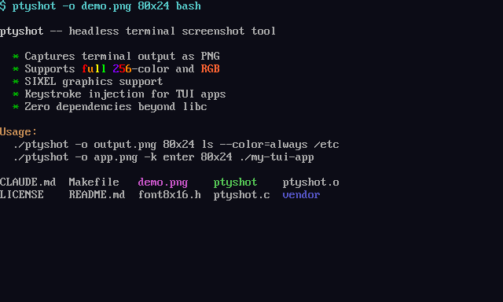

# ptyshot v0.3.0

**Headless terminal screenshot tool** — capture terminal output as PNG, text, JSON, or base64 without a display server.



ptyshot spawns a command in a virtual PTY, feeds it keystrokes, and renders the final screen to a PNG file — or outputs it as plain text, structured JSON, or base64-encoded PNG. It captures everything a real terminal would show: ANSI colors, cursor positioning, Unicode text, and SIXEL graphics. No X11, no Wayland, no framebuffer — just a single binary with zero dependencies beyond libc.

**Use cases:**
- **AI agent vision** — let LLMs and coding agents see what TUI applications look like by reading the PNG
- **CI/CD screenshots** — capture terminal UI state in headless pipelines for visual regression testing
- **Documentation** — generate terminal screenshots programmatically, no manual screenshotting
- **TUI development** — automate keystroke sequences and capture intermediate states for debugging

## Why

AI agents (Claude Code, Cursor, Copilot, etc.) working on terminal applications can't see what the terminal looks like. They can read text output, but not rendered colors, cursor positioning, or graphics. ptyshot bridges that gap: the agent runs `ptyshot`, reads the PNG with its vision capability, and sees exactly what a human would see — including SIXEL images.

## Install

```bash
curl -fsSL https://raw.githubusercontent.com/sa3lej/ptyshot/main/install.sh | sh
```

This auto-detects your platform (Linux x86_64, macOS ARM64), downloads a pre-built binary from the latest release, and installs to `/usr/local/bin`. Falls back to building from source if no binary is available.

To customize the install location:

```bash
curl -fsSL https://raw.githubusercontent.com/sa3lej/ptyshot/main/install.sh | INSTALL_DIR=~/.local/bin sh
```

### Build from source

Requires a C compiler and `libutil` (standard on Linux). No other dependencies.

```bash
git clone https://github.com/sa3lej/ptyshot && cd ptyshot && make
sudo install ptyshot /usr/local/bin/
```

That's it. Produces `./ptyshot`.

## Usage

```
ptyshot [--version] [--text] [--json] [--base64] [-o output.png]
        [-d delay_ms] [-k keystroke] [-S snap.png]
        [-R count:interval_ms:prefix] [-T]
        [-w settle_ms] [-m min_ms] [-W wait_text] COLSxROWS command [args...]
```

### Options

| Flag | Default | Description |
|------|---------|-------------|
| `--version` | — | Print version and exit |
| `--text` | off | Output cell buffer as plain text to stdout (trailing whitespace trimmed) |
| `--json` | off | Output cell buffer as JSON to stdout (`{cols, rows, cursor, cells}`) |
| `--base64` | off | Output PNG as base64 to stdout (for embedding in JSON protocols) |
| `-o FILE` | `screenshot.png` | Final output PNG path. With `--text`/`--json`/`--base64`, PNG file is only written if `-o` is explicitly given. |
| `-d MS` | `100` | Delay between keystrokes (ms) |
| `-k KEY` | — | Keystroke to send (repeatable, ordered with `-S` and `-R`) |
| `-S FILE` | — | Take a snapshot at this point in the action sequence (repeatable, ordered with `-k`) |
| `-R COUNT:MS:PREFIX` | — | Record mode: capture COUNT frames at MS intervals, saved as PREFIX_000.png, PREFIX_001.png, etc. (ordered with `-k` and `-S`) |
| `-T` | off | True terminal simulation: text writes erase SIXEL pixels at that cell. Combined with `-R`, captures the exact intermediate states a real terminal displays — including SIXEL flicker between character writes and SIXEL re-emission. |
| `-w MS` | `500` | Settle wait — time to wait for output quiescence (ms) |
| `-m MS` | `0` | Minimum read time — keep reading for at least this long before settling (ms). Only applies to the initial drain. |
| `-W TEXT` | — | Wait for this text to appear on screen before settling. Waits up to 30s, then warns and continues. |

### How `-k` and `-S` interact

Options `-k` and `-S` form an ordered action sequence. They execute left-to-right:

```bash
./ptyshot -S title.png -k 'enter' -S game.png -k 'j' -k 'enter' -o final.png 80x24 ./app
```

This captures `title.png` (initial screen), sends Enter, captures `game.png`, sends j then Enter, and writes `final.png` at the end.

### Keystroke format

Literal characters are sent as-is. Named keys are **case-insensitive** (`Enter`, `enter`, `ENTER` all work):

| Name | Sequence |
|------|----------|
| `enter` | CR |
| `tab` | TAB |
| `escape` / `esc` | ESC |
| `space` | SP |
| `backspace` | DEL |
| `up` `down` `left` `right` | Arrow keys |
| `ctrl-a` through `ctrl-z` | Control characters |

### Keystroke batching

Consecutive keystrokes (without intervening `-S` snapshots) use `usleep()` for inter-key timing instead of draining PTY output between each key. This ensures the app's event loop processes each key before the next arrives, which is critical for apps with continuous animation (where drain-based settling may not work reliably). The PTY is only drained after the last consecutive key or before a snapshot.

### Examples

Screenshot a command's output:

```bash
./ptyshot -o output.png 80x24 ls --color=always /etc
```

Interactive app with keystrokes (navigate a menu):

```bash
./ptyshot -o menu.png -k 'down' -k 'down' -k 'enter' 80x24 ./my-menu-app
```

Game-like app with multiple inputs:

```bash
./ptyshot -o game.png -d 200 -k 'j' -k 'j' -k 'l' -k 'l' -k 'k' 80x24 python3 game.py
```

Capture SIXEL graphics:

```bash
./ptyshot -o chart.png -w 1000 120x30 ./render-sixel-chart
```

Text output (no PNG, no vision API needed):

```bash
./ptyshot --text -w 200 80x24 ls --color=always /etc
```

JSON output for programmatic access to cell state:

```bash
./ptyshot --json -w 200 80x24 ./my-tui-app | jq '.cells[0][0].ch'
```

Base64 PNG for embedding in JSON (MCP, API responses):

```bash
./ptyshot --base64 -w 200 80x24 ./my-tui-app
```

Both text and PNG in one run:

```bash
./ptyshot --text -o screenshot.png -w 200 80x24 ./my-app
```

Wait for specific content before capturing (no timing guesswork):

```bash
./ptyshot -o game.png -W "Move 1" -w 30 120x40 ./my-tui-game
```

The `-W "Move 1"` waits until that text appears on screen, then settles with `-w 30` for the final frame.

App with continuous animation (combine `-W` with `-m` for reliability):

```bash
./ptyshot -o game.png -w 30 -m 1500 -W "Play vs AI" 120x40 ./my-tui-game
```

Multiple snapshots in a single run (title screen, then game board):

```bash
./ptyshot -o final.png -w 30 -m 1500 -W "Play vs AI" \
  -S title.png \
  -k 'down' -k 'enter' -k 'enter' -k 'enter' \
  -S game.png \
  -k 'enter' -k 'j' -k 'j' -k 'enter' \
  120x40 ./my-tui-game
```

This captures three PNGs: the title screen, the empty board, and the final state with moves.

Record cursor movement at 30ms intervals (debug animation/movement):

```bash
./ptyshot -o final.png -w 300 -m 300 \
  -k 'enter' -k 'enter' -k 'enter' \
  -k 'right' -R 20:30:/tmp/movement \
  100x35 ./my-tui-game
```

This captures 20 frames at 30ms intervals after pressing right, saving `/tmp/movement_000.png` through `/tmp/movement_019.png`.

Debug SIXEL flicker with true terminal simulation:

```bash
./ptyshot -T -o final.png -w 300 -m 300 \
  -k 'enter' -k 'enter' -k 'enter' \
  -k 'right' -R 5:200:/tmp/flicker \
  100x35 ./my-sixel-app
```

The `-T` flag makes ptyshot behave like a real terminal: writing text to a cell erases any SIXEL pixels at that position. Combined with `-R`, this captures per-`read()` snapshots showing the exact intermediate states — including frames where ratatui's character write has erased SIXEL pixels but the SIXEL re-emission hasn't arrived yet.

## Animated programs

Terminal programs with animations, progress bars, or continuous redraws need different capture strategies than static output. ptyshot provides several mechanisms — use them alone or combined.

### Wait for known text (`-W`)

If you know what the screen looks like when it's "ready", this is the most reliable approach. ptyshot watches for the text to appear, then captures:

```bash
# Wait for shell prompt
./ptyshot -o app.png -W "$ " 80x24 bash

# Wait for app to finish loading
./ptyshot -o dashboard.png -W "Ready" 120x40 ./my-dashboard
```

### Minimum read time (`-m`)

For apps that animate at startup, `-m` ensures ptyshot reads output for at least N milliseconds before considering the screen settled. Without it, a brief pause in the animation can trigger a premature capture:

```bash
# Read for at least 2 seconds, then capture when output stops
./ptyshot -o splash.png -m 2000 80x24 ./animated-splash

# Combine with shorter settle for responsive capture after the minimum
./ptyshot -o app.png -m 2000 -w 200 80x24 ./my-app
```

### Longer settle time (`-w`)

Increase the settle timeout for apps with bursty output that pauses briefly between frames:

```bash
# Default 500ms may be too short — wait 2s of silence instead
./ptyshot -o report.png -w 2000 80x24 ./slow-renderer
```

### Record multiple frames (`-R`)

Capture a burst of frames to see the animation unfold. This is ideal for debugging or documenting animated behavior:

```bash
# Capture 20 frames at 100ms intervals
./ptyshot -R 20:100:/tmp/anim 80x24 ./my-animated-app
# Produces /tmp/anim_000.png through /tmp/anim_019.png

# Record after sending a keystroke
./ptyshot -k 'enter' -R 15:200:/tmp/transition 80x24 ./my-app
```

### Combining strategies

For tricky apps, combine multiple flags:

```bash
# Wait for "Menu", read 1.5s minimum, then capture when stable
./ptyshot -o menu.png -W "Menu" -m 1500 -w 100 120x40 ./my-tui-app

# Capture title screen, send keystroke, record the transition
./ptyshot -S title.png -k 'enter' -R 10:150:/tmp/transition -o final.png \
  120x40 ./my-tui-app
```

### Quick reference

| Problem | Solution |
|---------|----------|
| App has a known ready state (prompt, status text) | `-W "text"` |
| App animates at startup, captures too early | `-m 2000` (read for 2s minimum) |
| App has bursty output with brief pauses | `-w 2000` (longer settle time) |
| Need to see the animation, not just the final frame | `-R 20:100:prefix` (record 20 frames) |
| App loads slowly then stops | `-m 3000 -w 200` (wait 3s, then settle quickly) |
| Need the exact moment specific content appears | `-W "text" -w 30` (wait for text, capture immediately) |

## How it works

1. Creates a PTY at the specified dimensions (cols x rows, 8x16 pixels per cell). Sets `ws_xpixel` and `ws_ypixel` in the winsize so child processes can detect pixel-level graphics support.
2. Forks and execs the command with `TERM=xterm-256color`
3. Reads PTY output through a built-in ANSI/VT100 parser into a virtual screen
4. Waits for output to settle (no new data for `-w` ms), optionally waiting for `-W` text
5. Executes the action sequence: sends keystrokes (`-k`) and takes snapshots (`-S`) in order
6. SIGTERMs the child process
7. Renders the screen to pixels: text via an embedded 8x16 bitmap font, SIXEL images composited on top
8. Writes output: PNG file (`-o`), or plain text (`--text`), JSON (`--json`), or base64 PNG (`--base64`) to stdout

### Settle behavior

The settle logic uses three complementary mechanisms:

1. **Quiescence timeout** (`-w`): If no data arrives for this many milliseconds, the screen is considered settled.

2. **DCS-aware**: Will not settle while the parser is mid-DCS sequence (e.g. receiving SIXEL data), preventing truncated graphics captures.

3. **Screen-stability detection**: If data is still arriving but the visible screen content hasn't changed across consecutive reads, the frame is considered complete. This handles continuous-animation apps that redraw the same content — the tool detects the screen is stable even though output never pauses. Uses FNV-1a hashing of the cell buffer for fast comparison.

For apps with slow startup or large first-frame renders, use `-m` to ensure at least one full frame is captured before the settle timer starts.

### What it handles

- UTF-8 and Unicode (Latin-1 supplement, box drawing, block elements, wide CJK characters)
- Full 256-color and RGB color (SGR 38/48;2 and 38/48;5)
- Bold, dim, reverse, underline attributes
- Cursor positioning (CUP, CUU, CUD, CUF, CUB, VPA)
- Screen clearing (ED, EL)
- Scrolling
- Alternate screen buffer (DECSET/DECRST 1049, 1047, 47)
- Device status responses (DSR cursor position, DA1/DA2 device attributes)
- SIXEL graphics (DCS sequences with raster attributes or manual scan)
- Tab stops, backspace, carriage return, newline
- chafa output (both block-character and SIXEL modes)

### What it doesn't handle

- Full Unicode coverage (unsupported codepoints render as tofu □)
- Scroll regions (DECSTBM)
- Mouse input
- OSC sequences (silently consumed)

## File structure

```
Makefile          — GNU make, no autotools
ptyshot.c         — Everything: PTY driver, ANSI parser, SIXEL decoder, renderer, PNG writer
font8x16.h        — Embedded 8x16 VGA bitmap font (generated C array)
vendor/
  stb_image_write.h — Single-header PNG writer (public domain)
```
